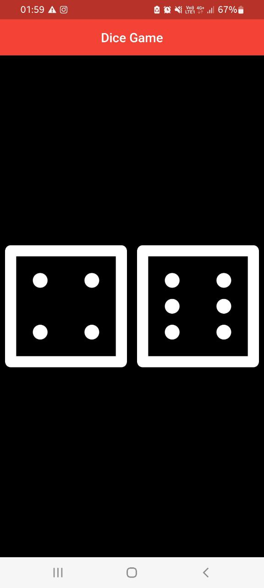

# Dice-App
This repo contains a Mini Dice Game I made in Flutter.

## How it works?
🕹 The player taps on Dice 1 🎲 and it changes the number on top of it. 
🕹 Dice 2 🎲 is played by the Computer and it changes when on Player's input. 
🕹 The Winner 🏆 is decided by whose dice's number is bigger.

## In-Progress
⌚ Currently working on the Winning animation and Score-Board.

## In-App Screenshots
<table align="center">
  <tr>
    <td align="center">Home Page</td>
  </tr>
  
  <tr>
    <td></td>
  </tr>
</table>
